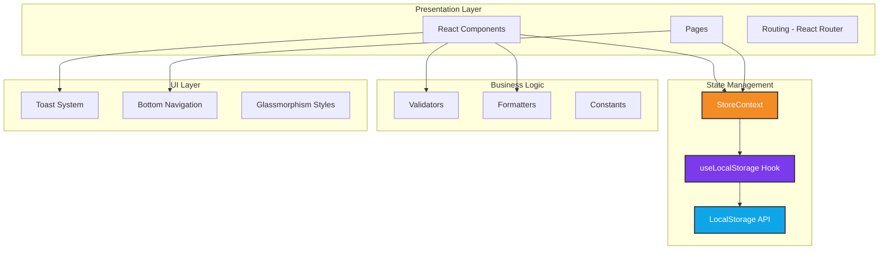
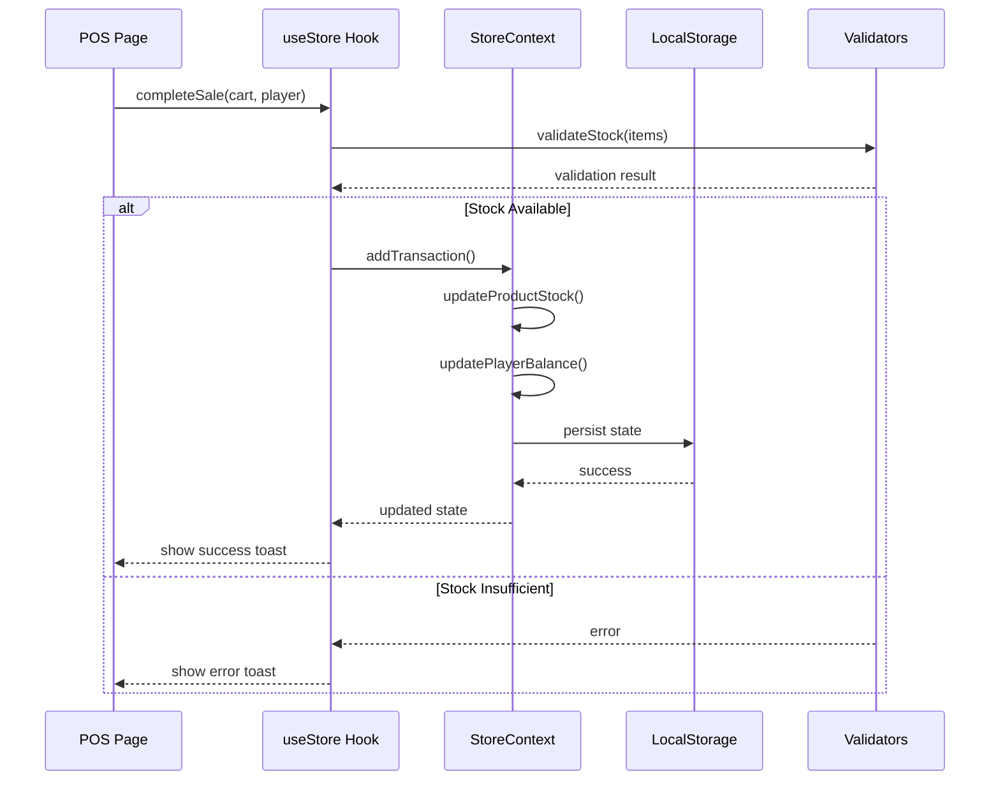

# TCG Store Manager - Technical Documentation

> **Last Updated**: December 2025  
> **Version**: 0.0.0  
> **Target Audience**: Mid to Senior Frontend Developers

---

## Table of Contents

1. [Overview](#overview)
2. [Architecture](#architecture)
3. [Tech Stack](#tech-stack)
4. [Project Structure](#project-structure)
5. [Core Concepts](#core-concepts)
6. [Data Flow](#data-flow)
7. [State Management](#state-management)
8. [Routing](#routing)
9. [Styling & Design System](#styling--design-system)
10. [Validation Layer](#validation-layer)
11. [Quick Start Guides](#quick-start-guides)
12. [Gotchas & Best Practices](#gotchas--best-practices)
13. [Mobile Deployment](#mobile-deployment)

---

## Overview

**TCG Store Manager** is a mobile-first Progressive Web App (PWA) designed for managing Trading Card Game (TCG) stores. It handles player accounts, product inventory, event management, point-of-sale transactions, and credit/debit tracking.

### Key Features

- 📱 **Mobile-First Design** - iOS-inspired UI with glassmorphism
- 💾 **Offline-First** - LocalStorage-based persistence
- 🎨 **Modern UI** - Animated backgrounds, smooth transitions
- 📦 **Product Management** - Inventory tracking with stock validation
- 👥 **Player Accounts** - Credit/debit system with transaction history
- 🎯 **Event Management** - Tournament creation and participant tracking
- 💰 **Point of Sale** - Cart-based sales with real-time stock updates
- 📱 **Android Ready** - Capacitor integration for native deployment

---

## Architecture

### High-Level Architecture



### Why This Architecture?

**Context API + LocalStorage** was chosen over Redux or external state management for several reasons:

1. **Simplicity**: No server-side persistence needed initially
2. **Offline-First**: Works without internet connection
3. **Performance**: Direct localStorage access is fast for small datasets
4. **Mobile-Ready**: Perfect for Capacitor deployment
5. **Zero Dependencies**: Reduces bundle size

> [!WARNING]
> **Scalability Consideration**: This architecture works well for single-store operations with <1000 products and <500 players. For multi-store or larger datasets, consider migrating to a backend API with IndexedDB.

---

## Tech Stack

### Core Technologies

| Technology | Version | Purpose |
|------------|---------|---------|
| **React** | 19.2.0 | UI framework |
| **TypeScript** | 5.8.2 | Type safety |
| **Vite** | 6.2.0 | Build tool & dev server |
| **React Router** | 7.9.6 | Client-side routing |
| **Tailwind CSS** | 3.x (CDN) | Utility-first styling |
| **Capacitor** | 7.4.4 | Native mobile wrapper |

### Why These Choices?

- **React 19**: Latest features including automatic batching and improved concurrent rendering
- **Vite**: Lightning-fast HMR and optimized builds
- **Tailwind CDN**: Rapid prototyping without build step complexity
- **HashRouter**: Required for Capacitor Android deployment (file:// protocol)
- **Capacitor**: Cross-platform mobile deployment with web-first approach

---

## Project Structure

```
tcg-store-manager/
├── android/                 # Capacitor Android project
├── components/              # Reusable UI components
│   ├── BottomNav.tsx       # Bottom navigation with FAB
│   └── Toast.tsx           # Toast notification system
├── context/                 # React Context providers
│   └── StoreContext.tsx    # Global state management
├── hooks/                   # Custom React hooks
│   ├── useLocalStorage.ts  # Persistent state hook
│   └── useToast.ts         # Toast notification hook
├── pages/                   # Route-level components
│   ├── Dashboard.tsx       # Home dashboard
│   ├── Players.tsx         # Player list
│   ├── PlayerProfile.tsx   # Individual player details
│   ├── Products.tsx        # Product inventory
│   ├── AddProduct.tsx      # Product form (add/edit)
│   ├── Events.tsx          # Event list
│   ├── EventDetails.tsx    # Event management
│   ├── POS.tsx             # Point of sale
│   ├── SalesHistory.tsx    # Transaction history
│   ├── Profile.tsx         # Store profile
│   ├── StoreData.tsx       # Store information
│   └── Settings.tsx        # App settings
├── utils/                   # Utility functions
│   ├── constants.ts        # App constants
│   ├── formatters.ts       # Data formatting utilities
│   └── validators.ts       # Validation functions
├── types.ts                 # TypeScript type definitions
├── App.tsx                  # Root component with routing
├── index.tsx                # React entry point
├── index.html               # HTML template
├── vite.config.ts           # Vite configuration
├── capacitor.config.ts      # Capacitor configuration
└── tsconfig.json            # TypeScript configuration
```

### Folder Conventions

- **components/**: Shared, reusable components (no route-specific logic)
- **pages/**: Route-level components (can use context, hooks, and components)
- **context/**: Global state providers (one provider per domain)
- **hooks/**: Custom hooks (prefix with `use`)
- **utils/**: Pure functions (no React dependencies)

---

## Core Concepts

### Type System

All data models are defined in [types.ts](file:///c:/Users/lucas/Downloads/tcg-store-manager/types.ts):

```typescript
// Core entities
export interface Player {
  id: string;
  name: string;
  nickname: string;
  avatarUrl: string;
  dci?: string;              // DCI number (optional)
  balance: number;           // Current credit/debit balance
  lastActivity?: string;     // ISO timestamp
}

export interface Product {
  id: string;
  name: string;
  category: string;
  stock: number;
  price: number;
  imageUrl: string;
  collection?: string;
  costPrice?: number;        // For profit calculation
}

export interface Event {
  id: string;
  date: string;              // ISO string for sorting
  title: string;
  price: number;
  time: string;              // HH:MM format
  maxEnrolled: number;
  participants: EventParticipant[];
}

export interface Transaction {
  id: string;
  playerId: string;
  type: 'credit' | 'debit';
  title: string;
  date: string;              // ISO string
  amount: number;
  icon: string;              // Material icon name
}
```

> [!TIP]
> **Date Handling**: All dates are stored as ISO strings for consistent sorting and timezone handling. Use the formatters in `utils/formatters.ts` for display.

---

## Data Flow

### Transaction Flow Example



### Key Flow Patterns

1. **User Action** → Component event handler
2. **Validation** → Utils validate input
3. **State Update** → Context provider updates state
4. **Persistence** → useLocalStorage auto-saves to localStorage
5. **UI Update** → React re-renders with new state
6. **Feedback** → Toast notification confirms action

---

## State Management

### StoreContext Pattern

The app uses a single context provider for all global state:

```typescript
// context/StoreContext.tsx
export const StoreProvider: React.FC<{ children: ReactNode }> = ({ children }) => {
  // State hooks with localStorage persistence
  const [players, setPlayers] = useLocalStorage<Player[]>(
    STORAGE_KEYS.PLAYERS, 
    INITIAL_PLAYERS
  );
  const [products, setProducts] = useLocalStorage<Product[]>(
    STORAGE_KEYS.PRODUCTS, 
    INITIAL_PRODUCTS
  );
  
  // Business logic methods
  const addProduct = useCallback((product: Product) => {
    const validation = validateProduct(product);
    if (!validation.isValid) {
      throw new Error(validation.errors.join(', '));
    }
    setProducts(prev => [...prev, product]);
  }, [setProducts]);
  
  // ... more methods
  
  return (
    <StoreContext.Provider value={contextValue}>
      {children}
    </StoreContext.Provider>
  );
};
```

### Using the Context

```typescript
// In any component
import { useStore } from '../context/StoreContext';

const MyComponent = () => {
  const { players, products, addProduct } = useStore();
  
  // Use state and methods
  return <div>{players.length} players</div>;
};
```

### LocalStorage Keys

Defined in [utils/constants.ts](file:///c:/Users/lucas/Downloads/tcg-store-manager/utils/constants.ts#L6-L13):

```typescript
export const STORAGE_KEYS = {
  PLAYERS: 'tcg-store-players',
  PRODUCTS: 'tcg-store-products',
  EVENTS: 'tcg-store-events',
  TRANSACTIONS: 'tcg-store-transactions',
  STORE_PROFILE: 'tcg-store-profile',
  STORE_SETTINGS: 'tcg-store-settings',
} as const;
```

> [!IMPORTANT]
> **Data Migration**: If you change the structure of stored data, you MUST handle migration in `useLocalStorage` or provide a version check. Otherwise, users will lose data or experience crashes.

---

## Routing

### HashRouter for Mobile

The app uses `HashRouter` instead of `BrowserRouter`:

```typescript
// App.tsx
<HashRouter>
  <Routes>
    <Route path="/" element={<Layout />}>
      <Route index element={<Dashboard />} />
      <Route path="players" element={<Players />} />
      {/* ... */}
    </Route>
  </Routes>
</HashRouter>
```

**Why HashRouter?**

Capacitor serves the app from `file://` protocol on Android. `BrowserRouter` requires a server to handle routes, but `HashRouter` works with client-side only routing (`#/players` instead of `/players`).

> [!CAUTION]
> **Do NOT switch to BrowserRouter** unless you're deploying to a web server with proper routing configuration. This will break Android builds.

### Route Structure

```typescript
// Layout routes (with BottomNav)
/ → Dashboard
/players → Players list
/products → Products list
/events → Events list

// Standalone routes (no BottomNav)
/player/:id → Player profile
/products/add → Add product
/products/edit/:id → Edit product
/events/:id → Event details
/pos → Point of sale
/sales-history → Transaction history
/profile → Store profile
/store-data → Store information
/settings → App settings
```

---

## Styling & Design System

### Glassmorphism Theme

The app uses a custom glassmorphism design system defined in [index.html](file:///c:/Users/lucas/Downloads/tcg-store-manager/index.html):

```css
/* Glass card - main content containers */
.glass-card {
  background: rgba(40, 40, 40, 0.4);
  backdrop-filter: blur(16px);
  border: 1px solid rgba(255, 255, 255, 0.08);
  box-shadow: 0 4px 30px rgba(0, 0, 0, 0.1);
}

/* Glass input - form fields */
.glass-input {
  background: rgba(255, 255, 255, 0.05);
  border: 1px solid rgba(255, 255, 255, 0.1);
  backdrop-filter: blur(4px);
}

/* Glass nav - bottom navigation */
.glass-nav {
  background: rgba(20, 20, 20, 0.7);
  backdrop-filter: blur(20px);
  border: 1px solid rgba(255, 255, 255, 0.08);
  box-shadow: 0 10px 40px rgba(0, 0, 0, 0.3);
}
```

### Color Palette

```javascript
colors: {
  primary: "#f48c25",           // Orange - main brand color
  positive: "#34c759",          // Green - success states
  negative: "#ff3b30",          // Red - error states
  "text-secondary-dark": "#a1a1aa", // Gray - secondary text
}
```

### Animated Background

Three floating blobs create dynamic background:

```html
<div class="blob-cont">
  <div class="blob blob-1"></div> <!-- Orange -->
  <div class="blob blob-2"></div> <!-- Purple -->
  <div class="blob blob-3"></div> <!-- Blue -->
</div>
```

### Typography

- **Display Font**: Space Grotesk (headings, bold text)
- **Body Font**: Inter (paragraphs, UI text)
- **Icons**: Material Symbols Outlined

### Responsive Design

Mobile-first with max-width constraint:

```tsx
<div className="flex justify-center min-h-screen w-full">
  <div className="relative flex flex-col w-full max-w-[480px]">
    {/* Content */}
  </div>
</div>
```

This creates a mobile app feel on desktop by constraining width to 480px.

---

## Validation Layer

### Validation Pattern

All user input is validated before state updates:

```typescript
// utils/validators.ts
export const validateProduct = (product: Partial<Product>): ValidationResult => {
  const errors: string[] = [];
  
  if (!product.name || product.name.trim().length === 0) {
    errors.push(ERROR_MESSAGES.PRODUCT_NAME_REQUIRED);
  }
  
  if (product.price <= 0) {
    errors.push(ERROR_MESSAGES.PRODUCT_PRICE_INVALID);
  }
  
  return {
    isValid: errors.length === 0,
    errors,
  };
};
```

### Using Validators

```typescript
// In StoreContext
const addProduct = useCallback((product: Product) => {
  const validation = validateProduct(product);
  if (!validation.isValid) {
    throw new Error(validation.errors.join(', '));
  }
  setProducts(prev => [...prev, product]);
}, [setProducts]);

// In component
try {
  addProduct(newProduct);
  showToast('Produto adicionado!', 'success');
} catch (error) {
  showToast(error.message, 'error');
}
```

### Available Validators

| Function | Purpose |
|----------|---------|
| `validateProduct()` | Product creation/update |
| `validateEvent()` | Event creation |
| `validatePlayer()` | Player creation |
| `validateStock()` | Stock availability check |
| `validateTransactionAmount()` | Transaction value |
| `validateEmail()` | Email format |
| `validateURL()` | URL format |

---

## Quick Start Guides

### Adding a New Page

**Step 1**: Create the page component

```tsx
// pages/MyNewPage.tsx
import React from 'react';
import { useNavigate } from 'react-router-dom';
import { useStore } from '../context/StoreContext';

const MyNewPage: React.FC = () => {
  const navigate = useNavigate();
  const { players } = useStore();
  
  return (
    <div className="relative flex flex-col w-full">
      <header className="flex items-center p-6 pb-2 pt-8">
        <button onClick={() => navigate(-1)}>
          <span className="material-symbols-outlined">arrow_back</span>
        </button>
        <h1 className="text-white text-3xl font-bold ml-4">My Page</h1>
      </header>
      
      <main className="flex-grow px-4">
        {/* Your content */}
      </main>
    </div>
  );
};

export default MyNewPage;
```

**Step 2**: Add route to [App.tsx](file:///c:/Users/lucas/Downloads/tcg-store-manager/App.tsx)

```tsx
import MyNewPage from './pages/MyNewPage';

// Inside <Routes>
<Route path="/my-new-page" element={<MyNewPage />} />
```

**Step 3**: Add navigation link

```tsx
// In any component
<button onClick={() => navigate('/my-new-page')}>
  Go to My Page
</button>
```

---

### Adding a New Entity Type

**Step 1**: Define the type in [types.ts](file:///c:/Users/lucas/Downloads/tcg-store-manager/types.ts)

```typescript
export interface MyEntity {
  id: string;
  name: string;
  createdAt: string;
  // ... other fields
}
```

**Step 2**: Add storage key to [utils/constants.ts](file:///c:/Users/lucas/Downloads/tcg-store-manager/utils/constants.ts)

```typescript
export const STORAGE_KEYS = {
  // ... existing keys
  MY_ENTITIES: 'tcg-store-my-entities',
} as const;
```

**Step 3**: Add validator to [utils/validators.ts](file:///c:/Users/lucas/Downloads/tcg-store-manager/utils/validators.ts)

```typescript
export const validateMyEntity = (entity: Partial<MyEntity>): ValidationResult => {
  const errors: string[] = [];
  
  if (!entity.name || entity.name.trim().length === 0) {
    errors.push('Name is required');
  }
  
  return { isValid: errors.length === 0, errors };
};
```

**Step 4**: Extend [StoreContext](file:///c:/Users/lucas/Downloads/tcg-store-manager/context/StoreContext.tsx)

```typescript
// Add to context type
interface StoreContextType {
  // ... existing
  myEntities: MyEntity[];
  addMyEntity: (entity: MyEntity) => void;
}

// Add to provider
const [myEntities, setMyEntities] = useLocalStorage<MyEntity[]>(
  STORAGE_KEYS.MY_ENTITIES,
  []
);

const addMyEntity = useCallback((entity: MyEntity) => {
  const validation = validateMyEntity(entity);
  if (!validation.isValid) {
    throw new Error(validation.errors.join(', '));
  }
  setMyEntities(prev => [...prev, entity]);
}, [setMyEntities]);

// Add to context value
const contextValue = useMemo(() => ({
  // ... existing
  myEntities,
  addMyEntity,
}), [myEntities, addMyEntity]);
```

---

### Creating a New Component

**Step 1**: Create component file

```tsx
// components/MyComponent.tsx
import React from 'react';

interface MyComponentProps {
  title: string;
  onAction?: () => void;
}

const MyComponent: React.FC<MyComponentProps> = ({ title, onAction }) => {
  return (
    <div className="glass-card rounded-2xl p-4">
      <h3 className="text-white font-bold">{title}</h3>
      {onAction && (
        <button 
          onClick={onAction}
          className="mt-2 px-4 py-2 bg-primary rounded-lg"
        >
          Action
        </button>
      )}
    </div>
  );
};

export default MyComponent;
```

**Step 2**: Use in pages

```tsx
import MyComponent from '../components/MyComponent';

<MyComponent 
  title="Hello" 
  onAction={() => console.log('clicked')} 
/>
```

---

### Adding Toast Notifications

```tsx
import { useToast } from '../hooks/useToast';

const MyComponent = () => {
  const { success, error, warning, info } = useToast();
  
  const handleAction = () => {
    try {
      // Do something
      success('Action completed!');
    } catch (err) {
      error('Action failed!');
    }
  };
  
  return <button onClick={handleAction}>Do Action</button>;
};
```

**Toast Types**:
- `success(message, duration?)` - Green checkmark
- `error(message, duration?)` - Red error icon
- `warning(message, duration?)` - Yellow warning icon
- `info(message, duration?)` - Blue info icon

Default duration: 3000ms (3 seconds)

---

## Gotchas & Best Practices

### 1. LocalStorage Limitations

> [!WARNING]
> **Storage Quota**: LocalStorage has a ~5-10MB limit per domain. For large datasets, consider:
> - Implementing data pagination
> - Archiving old transactions
> - Migrating to IndexedDB
> - Adding backend API

**Check storage usage**:

```typescript
const getStorageSize = () => {
  let total = 0;
  for (let key in localStorage) {
    if (localStorage.hasOwnProperty(key)) {
      total += localStorage[key].length + key.length;
    }
  }
  return (total / 1024).toFixed(2) + ' KB';
};
```

### 2. React 19 Specific Behaviors

**Automatic Batching**: React 19 batches all state updates, even in async functions:

```typescript
// These will batch automatically
const handleClick = async () => {
  setCount(c => c + 1);
  await fetch('/api');
  setName('John');  // Still batched!
};
```

**useCallback Dependencies**: Always include all dependencies:

```typescript
// ❌ Bad - missing dependency
const addItem = useCallback(() => {
  setItems([...items, newItem]);
}, []);

// ✅ Good - all dependencies included
const addItem = useCallback(() => {
  setItems(prev => [...prev, newItem]);
}, [newItem]);
```

### 3. Tailwind CDN Limitations

> [!CAUTION]
> **Production Consideration**: The app uses Tailwind CDN for rapid development. For production:
> - Install Tailwind via npm
> - Configure PostCSS
> - Purge unused styles
> - This reduces bundle size from ~3MB to ~10KB

### 4. Date Handling

Always use ISO strings for dates:

```typescript
// ✅ Good
const event = {
  date: new Date().toISOString(),  // "2025-12-18T18:00:00.000Z"
};

// ❌ Bad
const event = {
  date: new Date(),  // Object, won't serialize properly
};
```

### 5. Image URLs

The app uses Googleusercontent URLs for demo data. For production:

```typescript
// Replace with your own image hosting
const DEFAULT_AVATAR = 'https://your-cdn.com/default-avatar.png';

// Or use a service like Cloudinary, Imgix, or AWS S3
```

### 6. Material Icons

Icons use variable fonts. To fill an icon:

```tsx
// Outlined (default)
<span className="material-symbols-outlined">home</span>

// Filled
<span className="material-symbols-outlined filled">home</span>
```

### 7. Navigation Patterns

**Use navigate(-1) for back buttons**:

```tsx
import { useNavigate } from 'react-router-dom';

const navigate = useNavigate();

// ✅ Good - preserves history
<button onClick={() => navigate(-1)}>Back</button>

// ❌ Bad - hardcoded route
<button onClick={() => navigate('/players')}>Back</button>
```

### 8. Form Validation

Always validate on submit, not just on blur:

```tsx
const handleSubmit = (e: React.FormEvent) => {
  e.preventDefault();
  
  const validation = validateProduct(formData);
  if (!validation.isValid) {
    error(validation.errors[0]);
    return;
  }
  
  // Proceed with submission
};
```

---

## Mobile Deployment

### Android Build Process

**Prerequisites**:
- Android Studio installed
- Java JDK 17+
- Android SDK

**Step 1**: Build web assets

```bash
npm run build
```

**Step 2**: Sync with Capacitor

```bash
npx cap sync android
```

**Step 3**: Open in Android Studio

```bash
npx cap open android
```

**Step 4**: Build APK

In Android Studio:
- Build → Build Bundle(s) / APK(s) → Build APK(s)

### Capacitor Configuration

[capacitor.config.ts](file:///c:/Users/lucas/Downloads/tcg-store-manager/capacitor.config.ts):

```typescript
const config: CapacitorConfig = {
  appId: 'com.tcgstoremanager.app',
  appName: 'TCGStoreManager',
  webDir: 'dist'
};
```

**Key Settings**:
- `appId`: Unique package identifier (reverse domain)
- `appName`: Display name on device
- `webDir`: Build output directory (Vite uses `dist`)

### Testing on Device

**Via USB**:

```bash
npx cap run android
```

**Via WiFi** (device and computer on same network):

1. Enable WiFi debugging on Android device
2. Run `adb connect <device-ip>:5555`
3. Run `npx cap run android`

### Common Android Issues

**Issue**: App shows blank screen

**Solution**: Check that `HashRouter` is used, not `BrowserRouter`

---

**Issue**: Icons not showing

**Solution**: Ensure Material Icons font is loaded in [index.html](file:///c:/Users/lucas/Downloads/tcg-store-manager/index.html#L12)

---

**Issue**: LocalStorage not persisting

**Solution**: Check Android permissions in `AndroidManifest.xml`

---

## Performance Optimization

### Memoization

Use `useMemo` for expensive calculations:

```typescript
const sortedPlayers = useMemo(() => {
  return [...players].sort((a, b) => 
    b.balance - a.balance
  );
}, [players]);
```

### Callback Optimization

Use `useCallback` for event handlers passed to children:

```typescript
const handleDelete = useCallback((id: string) => {
  setPlayers(prev => prev.filter(p => p.id !== id));
}, [setPlayers]);
```

### Lazy Loading

For large lists, consider virtualization:

```bash
npm install react-window
```

```tsx
import { FixedSizeList } from 'react-window';

<FixedSizeList
  height={600}
  itemCount={players.length}
  itemSize={80}
  width="100%"
>
  {({ index, style }) => (
    <div style={style}>
      <PlayerCard player={players[index]} />
    </div>
  )}
</FixedSizeList>
```

---

## Testing Strategy

### Unit Tests (Recommended)

```bash
npm install -D vitest @testing-library/react @testing-library/jest-dom
```

**Test validators**:

```typescript
// utils/validators.test.ts
import { validateProduct } from './validators';

describe('validateProduct', () => {
  it('should reject empty name', () => {
    const result = validateProduct({ name: '' });
    expect(result.isValid).toBe(false);
    expect(result.errors).toContain('Nome do produto é obrigatório');
  });
});
```

**Test hooks**:

```typescript
// hooks/useLocalStorage.test.ts
import { renderHook, act } from '@testing-library/react';
import { useLocalStorage } from './useLocalStorage';

describe('useLocalStorage', () => {
  it('should persist value', () => {
    const { result } = renderHook(() => 
      useLocalStorage('test-key', 'initial')
    );
    
    act(() => {
      result.current[1]('updated');
    });
    
    expect(result.current[0]).toBe('updated');
    expect(localStorage.getItem('test-key')).toBe('"updated"');
  });
});
```

---

## Deployment

### Web Deployment

**Build**:

```bash
npm run build
```

**Preview**:

```bash
npm run preview
```

**Deploy to Vercel/Netlify**:

1. Connect GitHub repository
2. Set build command: `npm run build`
3. Set output directory: `dist`
4. Deploy

### Environment Variables

Create `.env.local`:

```bash
VITE_API_URL=https://api.example.com
VITE_APP_VERSION=1.0.0
```

Access in code:

```typescript
const apiUrl = import.meta.env.VITE_API_URL;
```

---

## Migration Paths

### From LocalStorage to Backend API

**Step 1**: Create API client

```typescript
// utils/api.ts
const API_URL = import.meta.env.VITE_API_URL;

export const api = {
  getPlayers: () => fetch(`${API_URL}/players`).then(r => r.json()),
  addPlayer: (player: Player) => 
    fetch(`${API_URL}/players`, {
      method: 'POST',
      body: JSON.stringify(player),
    }),
};
```

**Step 2**: Replace useLocalStorage with React Query

```bash
npm install @tanstack/react-query
```

```typescript
import { useQuery, useMutation } from '@tanstack/react-query';

const { data: players } = useQuery({
  queryKey: ['players'],
  queryFn: api.getPlayers,
});

const addPlayerMutation = useMutation({
  mutationFn: api.addPlayer,
});
```

**Step 3**: Migrate data

```typescript
// One-time migration script
const migrateToBackend = async () => {
  const players = JSON.parse(localStorage.getItem('tcg-store-players') || '[]');
  
  for (const player of players) {
    await api.addPlayer(player);
  }
  
  localStorage.removeItem('tcg-store-players');
};
```

---

## Troubleshooting

### Common Errors

**Error**: `useStore must be used within a StoreProvider`

**Solution**: Ensure `<StoreProvider>` wraps your component tree in [App.tsx](file:///c:/Users/lucas/Downloads/tcg-store-manager/App.tsx#L39)

---

**Error**: `Cannot read property 'map' of undefined`

**Solution**: Add optional chaining or default values:

```typescript
// ❌ Bad
{players.map(p => <div>{p.name}</div>)}

// ✅ Good
{players?.map(p => <div>{p.name}</div>) || <div>No players</div>}
```

---

**Error**: Toast not showing

**Solution**: Ensure `<ToastContainer>` is rendered in [App.tsx](file:///c:/Users/lucas/Downloads/tcg-store-manager/App.tsx#L40)

---

## Resources

### Official Documentation

- [React 19 Docs](https://react.dev)
- [TypeScript Handbook](https://www.typescriptlang.org/docs/)
- [Vite Guide](https://vitejs.dev/guide/)
- [React Router v7](https://reactrouter.com/en/main)
- [Tailwind CSS](https://tailwindcss.com/docs)
- [Capacitor Docs](https://capacitorjs.com/docs)

### Design Resources

- [Material Symbols](https://fonts.google.com/icons)
- [Glassmorphism Generator](https://hype4.academy/tools/glassmorphism-generator)
- [Coolors Palette Generator](https://coolors.co/)

---

## Contributing

### Code Style

- Use TypeScript strict mode
- Prefer functional components
- Use arrow functions for components
- Add JSDoc comments for complex functions
- Keep components under 300 lines

### Naming Conventions

- Components: PascalCase (`PlayerCard.tsx`)
- Hooks: camelCase with `use` prefix (`useToast.ts`)
- Utils: camelCase (`formatCurrency`)
- Constants: UPPER_SNAKE_CASE (`STORAGE_KEYS`)
- Types/Interfaces: PascalCase (`Player`, `StoreContextType`)

---

## Changelog

### Version 0.0.0 (Current)

- Initial release
- Core features: Players, Products, Events, POS
- LocalStorage persistence
- Android support via Capacitor
- Glassmorphism UI

---

## License

This project is private and proprietary.

---

**Questions?** Contact the development team or open an issue on GitHub.
